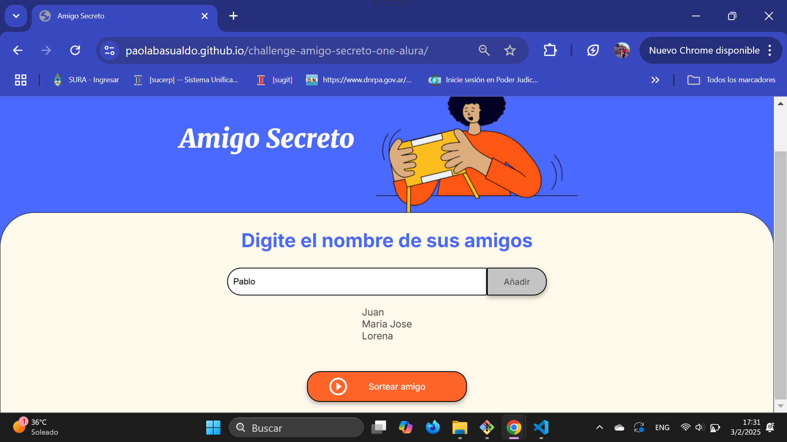
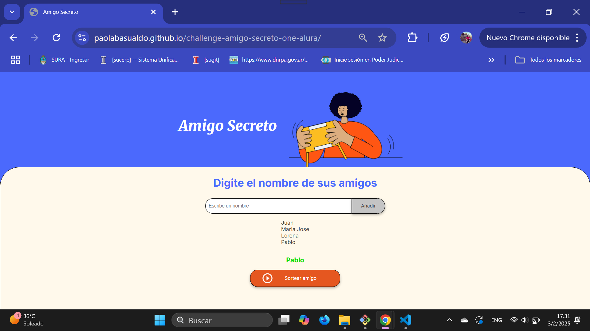

<h1 id="titulo-e-imagen-de-portada" align="center">
  Challenge Amigo Secreto  
   
  
</h1>

<h2 align="center">
  📌 Curso de Practicando Lógica de Programación:  
  Challenge Amigo Secreto - Programa ONE - Alura - Oracle
</h2>

   

---

## 📌 Índice

- [Título e imagen de portada](#titulo-e-imagen-de-portada)
- [Insignias](#insignias)
- [Índice](#-índice)
- [Descripción del proyecto](#-descripción-del-proyecto)
- [Estado del proyecto](#-estado-del-proyecto)
- [Características de la aplicación](#-características-de-la-aplicación)
  - [Funcionalidades del proyecto](#-funcionalidades-del-proyecto)
- [Acceso al proyecto](#-acceso-al-proyecto)
- [Tecnologías utilizadas](#-tecnologías-utilizadas)
- [Personas contribuyentes](#-personas-contribuyentes)
- [Desarrolladora del proyecto](#-desarrolladora-del-proyecto)

---

## 📖 Descripción del proyecto

Desarrollo de una aplicación llamada **Amigo Secreto**, que permite a los usuarios ingresar nombres de amigos en una lista para realizar un sorteo aleatorio y determinar quién es el "amigo secreto".  

🔹 El usuario podrá agregar nombres mediante un campo de texto y un botón **"Adicionar"**.  
🔹 Los nombres ingresados se mostrarán en una lista visible.  
🔹 Al finalizar, un botón **"Sortear Amigo"** seleccionará aleatoriamente un nombre y lo mostrará en pantalla.  

---

## 🚧 Estado del proyecto  

<h3 align="left">
  🚧 En construcción 🚧
</h3>

---

## 🛠️ Características de la aplicación  

  
  
  

### 🔧 Funcionalidades del proyecto  

✅ **Agregar nombres:** Los usuarios ingresarán un nombre en un campo de texto y lo añadirán a una lista visible mediante un botón **"Adicionar"**.  

✅ **Validación de entrada:** Si el campo de texto está vacío, el programa mostrará una alerta solicitando un nombre válido.  

✅ **Visualización de la lista:** Los nombres ingresados aparecerán en una lista debajo del campo de entrada.  

✅ **Sorteo aleatorio:** Al hacer clic en el botón **"Sortear Amigo"**, se seleccionará aleatoriamente un nombre de la lista y se mostrará en la pantalla.  

---

## 📁 Acceso al proyecto  

🔗 Repositorio en GitHub:  
[Challenge Amigo Secreto](https://github.com/PaolaBasualdo/challenge-amigo-secreto-one-alura)  

🔗 Versión desplegada en GitHub Pages:  
[Ver Proyecto](https://paolabasualdo.github.io/challenge-amigo-secreto-one-alura)  

---

## 🚀 Tecnologías utilizadas  

  
  
  

- **HTML5**
- **CSS3**
- **JavaScript**

---

## 🤝 Personas contribuyentes  

🎨 **CSS y HTML:** Equipo ONE  

---

## 👩‍💻 Desarrolladora del proyecto  

| [ Paola Ivana Basualdo](https://github.com/PaolaBasualdo) |  
| :---: |  

---

📌 *Proyecto realizado como parte del curso de lógica de programación en el Programa ONE de Alura y Oracle.*  
